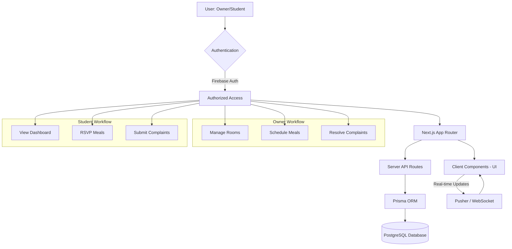
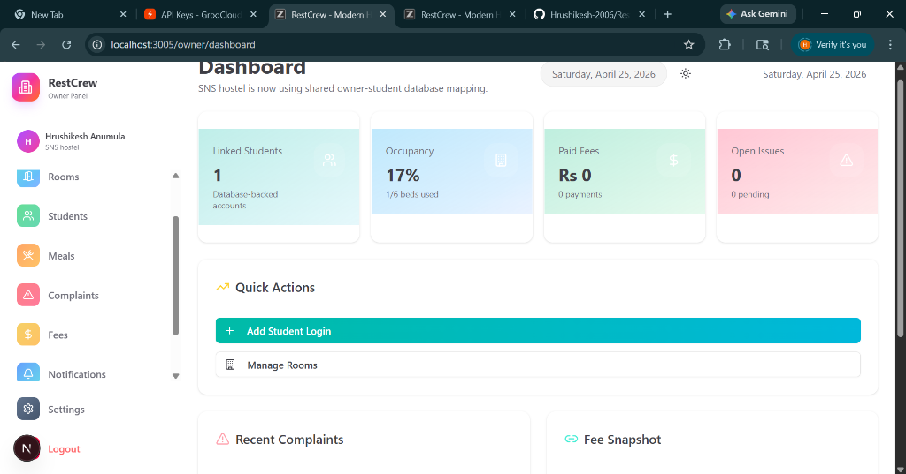
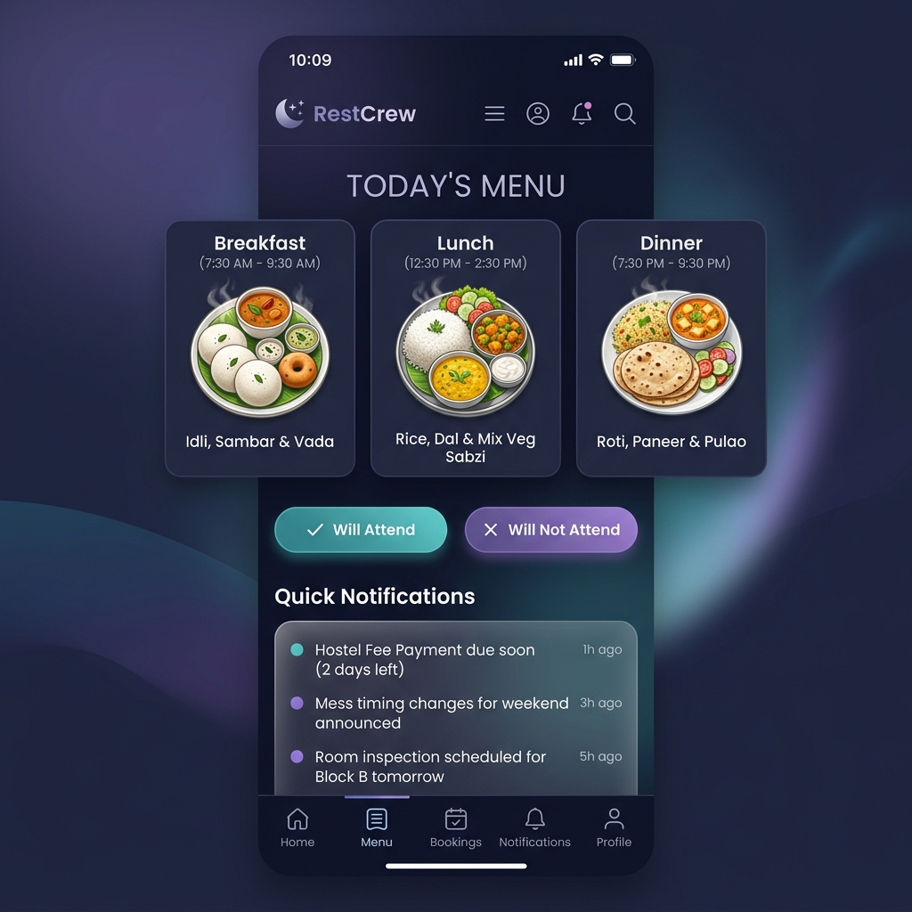

# RestCrew: Modern Hostel Management System 🏨✨

RestCrew is a state-of-the-art, full-stack hostel management platform designed to streamline operations for hostel owners and enhance the living experience for students. Built with a focus on real-time data, premium aesthetics, and seamless usability.

---

## 👥 Meet the Team

RestCrew was passionately developed and maintained by:

| Name | Role |
| :--- | :--- |
| **A. Hrushikesh** | 👑 **Team Leader** |
| **V. Manohar** | 🛠 **Team Member** |
| **G. Giri Charan** | 🛠 **Team Member** |

---

## 🚀 Project Overview

Managing a hostel involves complex coordination between room allocations, student records, meal planning, and complaint resolution. RestCrew centralizes all these tasks into a single, beautiful interface. It ensures data persistence using a high-performance PostgreSQL backend and provides instant updates through a modern reactive frontend.

### Key Features

#### 👑 For Hostel Owners
- **Dynamic Dashboard**: Real-time stats on occupancy, student strength, and pending tasks.
- **Room Management**: Easy allocation and tracking of room availability.
- **Student Database**: Comprehensive records of all residents with quick search and filters.
- **Automated Meal Planning**: Schedule meals (Breakfast, Lunch, Dinner) and track student participation.
- **Complaint Tracking**: Efficiently manage and resolve student issues with status updates.
- **Fee Management**: Track payments and pending dues effortlessly.

#### 🎓 For Students
- **Personal Dashboard**: View room details and upcoming hostel events.
- **Real-time Meal RSVP**: See the daily menu and mark attendance to reduce food wastage.
- **Seamless Complaints**: Submit issues directly through the app and track resolution progress.
- **Instant Notifications**: Receive updates from the owner about important hostel news.

---

## 🛠 Tech Stack

RestCrew is built using the most modern web technologies for maximum performance and reliability.

| Layer | Technology |
| :--- | :--- |
| **Frontend Framework** |  |
| **User Interface** |   |
| **Database & ORM** |   |
| **Authentication** |  |
| **Animations** |  |
| **Deployment** |  |

---

## 📊 System Architecture

The following flowchart illustrates how the RestCrew platform handles data flow and user interactions:

---

## 🎨 Interface Previews

### Owner Dashboard
The central hub for hostel administration, featuring glassmorphism cards and real-time analytics.

### Hosteler Portal
A mobile-optimized interface allowing students to manage their hostel life on the go.

---

## 🏗 How it was Built

The development of RestCrew followed a rigorous engineering process:

1. **Requirement Analysis**: Identifying the pain points of traditional hostel management (manual logs, food wastage, delayed complaints).
2. **Schema Design**: Architecting a robust relational database schema using Prisma to handle complex relationships between owners, students, and hostel activities.
3. **UI/UX Development**: Implementing a premium "Dark Mode" aesthetic using Tailwind CSS 4 and Framer Motion for smooth transitions.
4. **Backend Integration**: Developing dynamic API routes in Next.js that interact with PostgreSQL, ensuring data persistence across sessions.
5. **Real-time Sync**: Integrating Pusher and Zustand to provide an app-like experience where data updates instantly across all connected users.
6. **Persistence Migration**: Moving from transient local storage to a production-grade PostgreSQL instance to ensure zero data loss.

---

© 2026 RestCrew Team. All rights reserved.
